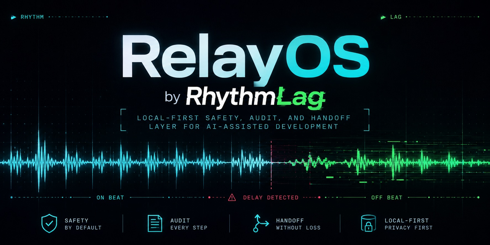

# RelayOS

A RhythmLag project.

<p align="center">
  
</p>

RelayOS is a local-first control layer for AI-assisted development. It validates and records task handoffs, enforces policy gates before agent launches, and stores evidence locally so the human stays in control. Claude Code and Codex CLI are the current first-party integrations; the envelope format and MCP surface are designed to accommodate additional agents and providers. Nothing leaves your machine. No cloud, no accounts, no auto-execute.

## Who it is for

**Solo / indie developers** — structured handoffs replace copy-pasted prompts between AI sessions. Rookie Mode keeps the workflow chat-only. Policy gates and diff-risk checks prevent unsafe commits. Checkpoint snapshots preserve evidence before risky work.

**Teams and enterprises** — the same local foundation is designed to extend to policy management, audit timelines, rollback, approval queues, and a risk dashboard. See [Roadmap](#roadmap).

## The problem

| Problem | Without RelayOS |
|---|---|
| Context loss | Long AI sessions drop agent-to-agent instructions on window switch |
| Unsafe AI changes | An agent edits `.env`, rewrites CI config, or drops hundreds of lines with no pre-commit check |
| Unclear permissions | File scope and model choice are implied, not recorded |
| Missing audit trail | Nothing logs which agent did what, with which model, under what constraints |
| Hard to review diffs | AI-generated changes touch auth, secrets, or deps without flagging |
| Unreliable coordination | Notes and next steps live only in terminal scrollback |

## How the workflow fits together

```
Human → planning agent
      → RelayOS handoff  (validate + record envelope)
      → policy check     (allow / warn / block before launch)
      → checkpoint       (snapshot HEAD + diff before launch)
      → execution agent  (patch / review / test)
      → diff-risk        (classify working tree before git commit)
      → relayos report   (evidence snapshot)
      → human reviews and commits
```

No step runs automatically unless you ask. Every event is appended to an audit log.

## Current features

### Handoff envelopes

Records a validated task envelope on disk: `model`, `effort`, `execution_mode`, `allowed_files`, `forbidden_files`, `constraints`, `expected_output`. Any MCP-capable agent reads the same envelope — no copy-pasting, no lost fields.

### Templates and quick handoff

Six built-in templates cover the common cases. Pass the task as plain text; RelayOS fills the rest. Override per-call or via `.relayos/config.json`.

### `relayos launch`

Print the exact `codex exec` or `claude -p` command for the newest open handoff. Print-only, never spawns. See [`docs/LAUNCH.md`](docs/LAUNCH.md).

### Policy gates

Evaluate a handoff envelope as `allow` / `warn` / `block` before running the target agent. Detects: high-effort patches, secret file scope, CI/deploy path scope, and risky commands.

### `relayos checkpoint`

Snapshot HEAD + `git status` + diff + untracked files before a risky handoff. Stored locally, listable and readable after the fact. See [`docs/CHECKPOINTS.md`](docs/CHECKPOINTS.md).

### `relayos diff-risk`

Classify the current working tree as `allow` / `warn` / `block` before `git commit`. Detects: secret config paths, CI/deploy paths, dependency manifests, auth/security/payment/database paths, large deletions, and risky commands in added diff lines. Read-only — no working-tree mutation. See [`docs/DIFF_RISK.md`](docs/DIFF_RISK.md).

### `relayos report`

Print a compact evidence snapshot in four sections: latest handoff, latest checkpoint, diff-risk summary, and git status. One command, exit 0.

### `relayos overseer`

Local coordination workspace stored under `.relayos/overseer/` (gitignored). Append timestamped notes, set and read a current next action. Survives terminal closes and context resets. See [`docs/OVERSEER.md`](docs/OVERSEER.md).

## Safety model

- **Print-only by default.** `relayos launch` prints the command; you run it. `auto_spawn` is opt-in per call, never the default.
- **Deterministic policy checks.** Allow/warn/block decisions are rule-based, not probabilistic.
- **Checkpoint before risky work.** `relayos checkpoint create` preserves a recoverable snapshot before you hand off a risky task.
- **Diff-risk before commit.** `relayos diff-risk` catches secrets, CI changes, and risky commands before they land in git history.
- **Safe from accidental commits.** `.relayos/overseer/` is gitignored in the project repo. Handoff storage (envelopes, checkpoints, audit logs) defaults to `~/.claude/handoff/` — outside any project repo entirely.
- **No cloud, no accounts, no telemetry.** All storage is local files on your machine.

## Quick start

### 1. Install

```bash
git clone https://github.com/EinProfispieler/relayos.git
cd relayos
npm install
npm run build
npm link
```

`npm link` makes `relayos` available as a global command in your terminal.

### 2. Register the MCP server

Run `./scripts/install.sh` to print the registration snippets with your local path filled in. Then paste them into your client configs:

**Claude Code** (`~/.claude.json` → `mcpServers`):

```json
"relayos": {
  "type": "stdio",
  "command": "node",
  "args": ["/path/to/relayos/dist/index.js"]
}
```

**Codex CLI** (`~/.codex/config.toml`):

```toml
[mcp_servers.relayos]
type = "stdio"
command = "node"
args = ["/path/to/relayos/dist/index.js"]
```

Restart both CLIs after registering so they pick up the tool list.

### 3. MCP tools (inside an AI agent session)

Once registered, 14 MCP tools are available from within any MCP-capable agent session (Claude Code, Codex CLI, or others). Common ones:

- `list_templates` — discover built-in and project templates
- `create_quick_handoff` — one-shot handoff from a task description
- `create_handoff_from_template` — handoff with template + overrides
- `read_latest_handoff` — Codex reads its current assignment
- `doctor` — health check for config and storage

See [MCP tools](#mcp-tools) for the full table.

### 4. Terminal CLI helpers

From any terminal in your project:

```bash
# Print a RelayOS ASCII banner
relayos banner

# Print the launch command for the newest open handoff
relayos launch latest

# Evaluate the newest handoff as allow/warn/block
relayos policy latest

# Snapshot HEAD + diff before launching an agent
relayos checkpoint create

# List and inspect checkpoints
relayos checkpoint list
relayos checkpoint show latest

# Preview a rollback plan (no mutation)
relayos checkpoint restore latest --dry-run

# Classify the working tree before git commit
relayos diff-risk

# Print an evidence snapshot (handoff + checkpoint + diff-risk + git status)
relayos report

# Coordination workspace
relayos overseer status
relayos overseer next "review PR #42"
relayos overseer note "blocked: CI failing on auth tests"

# Structured context (branch + progress)
relayos overseer init-context
relayos overseer branch "add auth middleware"
relayos overseer progress "tests passing, moving to review"
relayos overseer brief
```

Shell aliases are optional and user-managed. RelayOS does not modify
Claude/Codex binaries and does not install aliases automatically; see
[`docs/SHELL_ALIASES.md`](docs/SHELL_ALIASES.md) for copy-paste examples.

## Rookie Mode

The quickest path to a working multi-agent setup. Drop two files in place:

1. `examples/claude-subagents/relayos-orchestrator.md` → `~/.claude/agents/`
2. `examples/codex/AGENTS.md` → your project root

Then talk to Claude normally. Claude files the handoff; switch to a Codex terminal and Codex reads its assignment. Full walkthrough: [**docs/ROOKIE_MODE.md**](docs/ROOKIE_MODE.md).

## Walkthroughs

- [**docs/WALKTHROUGH.md**](docs/WALKTHROUGH.md) — solo developer walkthrough: context recovery → handoff → checkpoint → diff-risk → report → rollback plan
- [**docs/QUICK_DEMO.md**](docs/QUICK_DEMO.md) — 5-step Claude → RelayOS → Codex demo
- [**docs/ROOKIE_MODE.md**](docs/ROOKIE_MODE.md) — chat-only workflow, including the risk gate
- [**docs/LAUNCH.md**](docs/LAUNCH.md) — `relayos launch` reference
- [**docs/CHECKPOINTS.md**](docs/CHECKPOINTS.md) — `relayos checkpoint` reference
- [**docs/DIFF_RISK.md**](docs/DIFF_RISK.md) — `relayos diff-risk` reference
- [**docs/OVERSEER.md**](docs/OVERSEER.md) — `relayos overseer` reference
- [**docs/SHELL_ALIASES.md**](docs/SHELL_ALIASES.md) — optional user-managed shell aliases
- [**docs/REFERENCES.md**](docs/REFERENCES.md) — RelayOS vs OpenSpec and Superpowers; future interoperability ideas
- [**docs/MODEL_STRATEGY.md**](docs/MODEL_STRATEGY.md) — role templates, model/provider selection, and the future model-role matrix

---

## Tools

### MCP tools

Available inside any MCP-capable agent session once the server is registered.

| Tool | Purpose |
|---|---|
| `create_handoff` | Validate + record a handoff envelope; optionally spawn the target. |
| `create_handoff_from_template` | Create a handoff from a named template + short task string. |
| `create_quick_handoff` | One-shot: pick a template from `target_agent` + `mode`. |
| `list_templates` | List built-in + project handoff templates. |
| `validate_handoff` | Pure schema check — no side effects. |
| `render_claude_prompt` | Render the prompt + `claude -p` argv for an envelope. |
| `render_codex_prompt` | Render the prompt + `codex exec` argv for an envelope. |
| `write_audit_log` | Append a custom audit event to an existing handoff. |
| `list_handoffs` | List envelopes (newest first), filter by source/target/status. |
| `read_handoff` | Return one envelope + all its audit events. |
| `read_latest_handoff` | Return the most recent open handoff (filter by `assigned_to`). |
| `list_open_handoffs` | List open handoff summaries — no full envelope leak. |
| `inspect_config` | Show the effective RelayOS config: storage dir, templates, warnings. |
| `doctor` | Run health checks; never throws on broken state. |

### CLI commands

Available from any terminal after `npm link` (or via `./bin/relayos`).

| Command | Purpose |
|---|---|
| `relayos banner` | Print a local RelayOS ASCII banner for shell startup or manual reminders. |
| `relayos launch [id\|latest]` | Print the launch command for the newest open handoff. See [docs/LAUNCH.md](docs/LAUNCH.md). |
| `relayos policy [id\|latest]` | Evaluate a handoff envelope as allow/warn/block. |
| `relayos checkpoint <create\|list\|show\|restore>` | Snapshot HEAD + status + diff before risky handoffs. See [docs/CHECKPOINTS.md](docs/CHECKPOINTS.md). |
| `relayos diff-risk` | Classify the current working tree before `git commit`. See [docs/DIFF_RISK.md](docs/DIFF_RISK.md). |
| `relayos report` | Print a compact evidence snapshot: handoff, checkpoint, diff-risk, git status. |
| `relayos overseer <status\|note\|next\|brief\|init-context\|branch\|progress>` | Local coordination workspace: notes, next-action, branch/progress context. See [docs/OVERSEER.md](docs/OVERSEER.md). |

### Diagnostics

If something looks off — wrong template winning, envelope not appearing, server running stale code — call `doctor` for a one-shot health report and `inspect_config` for the resolved config. Both degrade gracefully on broken state. After `npm run build`, restart your agent session so the MCP host picks up the refreshed binary.

---

## Handoff envelope

```ts
{
  source_agent:     "claude" | "codex",
  target_agent:     "claude" | "codex",
  model:            string,
  effort:           "max" | "xhigh" | "high" | "medium" | "low",
  execution_mode:   "read_only" | "plan" | "patch" | "test" | "review",
  task_title:       string,
  task_description: string,
  allowed_files:    string[],   // globs; [] = no restriction
  forbidden_files:  string[],
  constraints:      string[],
  expected_output:  string | string[],
  working_dir?:     string,
  auto_spawn?:      boolean,    // default false
  audit_metadata?:  { parent_handoff_id?, source_session_id?, tags? }
}
```

`auto_spawn` defaults to `false`. RelayOS validates, writes the envelope, appends audit events, and returns a ready-to-paste `launch_command`. Nothing runs until you do.

When `auto_spawn=true`: if the target CLI is missing, the call hard-fails with `error.code = "missing_target_cli"` (envelope still recorded). If the CLI is found, RelayOS spawns it and captures stdout/stderr.

## Templates and project config

### Built-in templates

| Name | target | mode | model | effort |
|---|---|---|---|---|
| `codex-patch` | codex | patch | `gpt-5.5` | high |
| `codex-review` | codex | review | `gpt-5.5` | medium |
| `codex-test` | codex | test | `gpt-5.5` | medium |
| `codex-plan` | codex | plan | `gpt-5.5` | high |
| `claude-review` | claude | review | `claude-opus-4-7` | medium |
| `claude-plan` | claude | plan | `claude-opus-4-7` | high |

No built-in template defaults to `max` or `xhigh`. Use `overrides.effort` when you want to deviate. `codex-patch` is the default for code-patch handoffs.

### Project config — `.relayos/config.json` (optional)

```json
{
  "version": 1,
  "defaults": {
    "forbidden_files": [".env*", "secrets/**", "**/node_modules/**"],
    "constraints": ["No new dependencies without approval."]
  },
  "templates": {
    "codex-patch": { "allowed_files": ["src/**", "tests/**"], "effort": "high" }
  }
}
```

Merge order (lowest precedence first): built-in → project `defaults` → project per-template → call-time `overrides`.

## Storage layout

```
$HANDOFF_DIR/                    # default: ~/.claude/handoff/
├── audit.jsonl                  # append-only, one JSON event per line
└── envelopes/
    ├── h_01HQ….json             # full envelope
    ├── h_01HQ….stdout.log       # only when auto_spawn=true
    └── h_01HQ….stderr.log

.relayos/overseer/               # project-local, gitignored
├── timeline.jsonl               # append-only notes log
└── next_action.md               # current next action (overwritten each set)
```

Override `HANDOFF_DIR` via environment variable (default `~/.claude/handoff/`).

> **Do not commit** handoff envelopes, checkpoint instances, audit logs, overseer notes, transcripts, or private scratch files. Handoff storage lives outside the repo by default; `.relayos/overseer/` is gitignored.

---

## Examples

### Create a handoff from a template

```json
{
  "template": "codex-patch",
  "task": "Refactor src/api/util/format.ts to use template literals. Behavior must be identical.",
  "overrides": {
    "allowed_files": ["src/api/util/**/*.ts", "tests/api/util/**"]
  }
}
```

### One-shot quick handoff

```json
{ "target_agent": "codex", "task": "Run unit tests under tests/api/util.", "mode": "test" }
```

Codex defaults to `patch` when `mode` is omitted. Claude defaults to `plan`. Unmapped combinations (`claude` + `patch`, `claude` + `test`) throw `quick_handoff_no_template` — use `create_handoff_from_template` with a project template.

### Codex reads its assignment

In the Codex session:

```json
{ "assigned_to": "codex" }
```

Returns the latest open envelope for Codex — full task, scope, and expected output. If `envelope` is `null`, nothing is queued.

---

## Roadmap

RelayOS Core remains local-first. Team/Enterprise features are future server/panel scope built on the same local evidence model.

### Core / Solo (shipped)

| Feature | Status |
|---|---|
| Handoff + launch flow | done |
| Rookie Mode risk gate | done |
| Policy gates | done |
| Checkpoint | done |
| diff-risk scanner | done |
| Report command | done |
| Overseer workspace | done |

### Team / Enterprise (future, not in this repo)

These require a server component and are out of scope for the OSS core. No timeline is set.

- Internal web panel / dashboard
- Audit timeline with visual evidence review
- Rollback center
- Approval queue (human-in-the-loop gate before launch)
- Risk dashboard (aggregate diff-risk + policy across agents)
- Policy management UI
- Agent registry
- Multi-repo support

---

## Development

```bash
npm install
npm test           # vitest run
npm run typecheck  # tsc --noEmit
npm run build      # tsup → dist/
```

Override storage for tests: `HANDOFF_DIR=/tmp/scratch npm test`

---

## License

MIT
